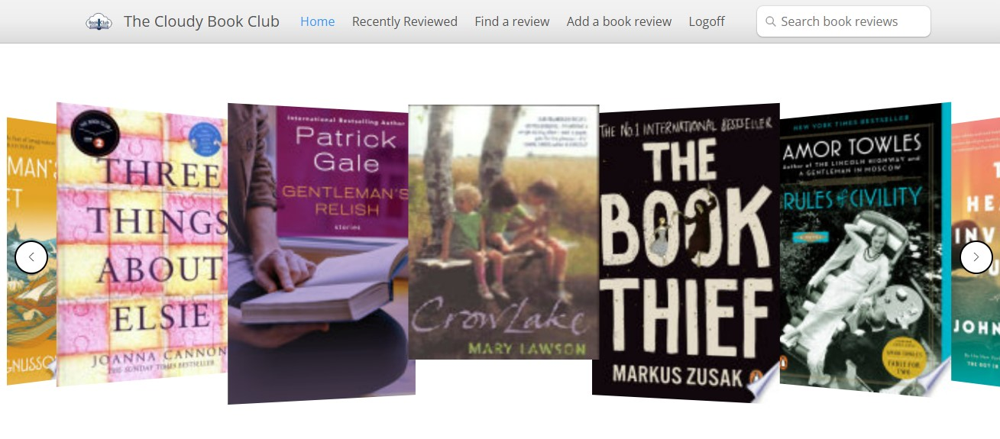

<a id="readme-top"></a>

<br />
<div align="center">
  <a href="https://cloudybookclub.com">
    
  </a>

  <h3 align="center">Books React</h3>

  <p align="center">
    A simple React / Typescript front end for the <a href="https://github.com/aidanwhiteley/books">Books microservice</a>.
  </p>

</div>


<!-- TABLE OF CONTENTS -->
<details>
  <summary>Table of Contents</summary>
  <ol>
    <li>
      <a href="#about-the-project">About The Project</a>
    </li>
    <li>
      <a href="#getting-started">Getting Started</a>
      <ul>
        <li><a href="#prerequisites">Prerequisites</a></li>
        <li><a href="#installation">Installation</a></li>
      </ul>
    </li>
    <li><a href="#usage">Usage</a></li>
    <li><a href="#configuration">Configuration</a></li>
    <li><a href="#tests">Tests</a></li>
    <li><a href="#docker">Docker</a></li>
    <li><a href="#license">License</a></li>
    <li><a href="#contact">Contact</a></li>
    <li><a href="#acknowledgments">Acknowledgments</a></li>
  </ol>
</details>

## About The Project

[](https://cloudybookclub.com)

A while back, I wanted a simple "microservice" to use while playing with technologies like Docker, Docker Compose and Kubernetes. As I have a bad habit of wandering into book shops and buying books I've already read, my wife suggested writing something to record what I've read recently. Hence, the <a href="https://github.com/aidanwhiteley/books">Books microservice</a> and the <a href="https://cloudybookclub.com">The Cloudy Book Club</a> were born.

This project provides a simple React / Typescript front end for the book microservice.

This project replaces a previous <a href="https://github.com/aidanwhiteley/books-web">project</a> that used <a href="https://angularjs.org/">AngularJS</a>. Aside from AngularJS being long dead, that implementation was very poor on mobile devices (which is when I most need to use the project when in book shops).

<p align="right">(<a href="#readme-top">back to top</a>)</p>

<!-- GETTING STARTED -->
## Getting Started

Here's how to get up and running with this project.

### Prerequisites

1. You should have a recent version of <a href="https://docs.npmjs.com/downloading-and-installing-node-js-and-npm">npm</a> installed.
2. Ideally, you should have an instance of the <a href="https://github.com/aidanwhiteley/books">Books microservice</a> running locally on your computer on port 8080. However, if Java isn't your thing, an alternative that allows access to all the read-only functionality of this front end app is detailed further below. 

### Installation

1. Clone the repo
   ```
   git clone https://github.com/aidanwhiteley/books-react.git
   ```
2. Install NPM packages
   ```
   npm install
   ```

<p align="right">(<a href="#readme-top">back to top</a>)</p>

<!-- USAGE EXAMPLES -->
## Usage

1. To run in development
   ```
   npm run dev
   ```
   and then enter "o" to open a browser
2. To build for production
   ```
   npm run build
   ```

   <p align="right">(<a href="#readme-top">back to top</a>)</p>

## Configuration

There are a few "global variables" defined in the `.env` file in the root folder. These should be edited as required.

In particular, the checked in .env file has `VITE_API_URL=http://localhost:8080` which assumes that you are running the books microservice locally (see earlier in this README).

To try out the read-only parts of this front end application this can be temporarily changed to `VITE_API_URL=https://cloudybookclub.com`. This won't allow you to logon to access editor or admin functionality but does allow you to get started. Make sure that you don't add a trailing slash. 

<p align="right">(<a href="#readme-top">back to top</a>)</p>

## Tests
Nah - there aren't any. This front end project is deliberately light in any "business logic". It is all just display related code. And I have rather strong feelings about the utility (and encumberances) of much of the client side "unit tests" I've seen in the past. Anyways, the server side, where all the logic is, has about about 100 automated tests and about <a href="https://sonarcloud.io/project/overview?id=com.aidanwhiteley%3Abooks">85% code coverage</a> split between unit tests and, the far more important in the long term, integration tests.

<p align="right">(<a href="#readme-top">back to top</a>)</p>

## Docker
There is a Docker file in the root of the project that is intended to build a simple Docker image of the project that runs serves it using ngnix. The referenced nginx config file(s) 
proxy API calls other Docker containers that are specified in the Docker Compose file in the <a href="https://github.com/aidanwhiteley/books">Books microservice</a> project.
See the Docker file for the suggested syntax for building the Docker image.

<p align="right">(<a href="#readme-top">back to top</a>)</p>

## License

Distributed under the Apache 2.0 License. See <a href="LICENSE">LICENSE</a> for more information.

<p align="right">(<a href="#readme-top">back to top</a>)</p>

<!-- CONTACT -->
## Contact

Your Name - [Aidan Whiteley](https://aidanwhiteley.com/) - github@aidanwhiteley.com

<p align="right">(<a href="#readme-top">back to top</a>)</p>

<!-- ACKNOWLEDGMENTS -->
## Acknowledgments

Here are the main components used in this project

* [React Router](https://reactrouter.com/en/main)
* [React Router Typesafe](https://github.com/fredericoo/react-router-typesafe)
* [Bootstrap 5](https://getbootstrap.com/)
* [React Bootstrap](https://react-bootstrap.netlify.app/)
* [React Bootstrap Typeahead](https://github.com/ericgio/react-bootstrap-typeahead)
* [React Data Table Component](https://github.com/jbetancur/react-data-table-component)
* [Swiper](https://swiperjs.com/react)
* [DOM Purify](https://github.com/cure53/DOMPurify)

<p align="right">(<a href="#readme-top">back to top</a>)</p>
